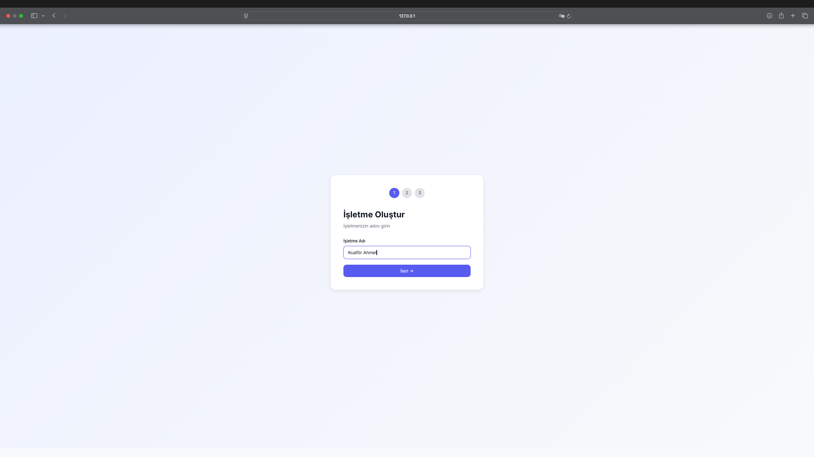
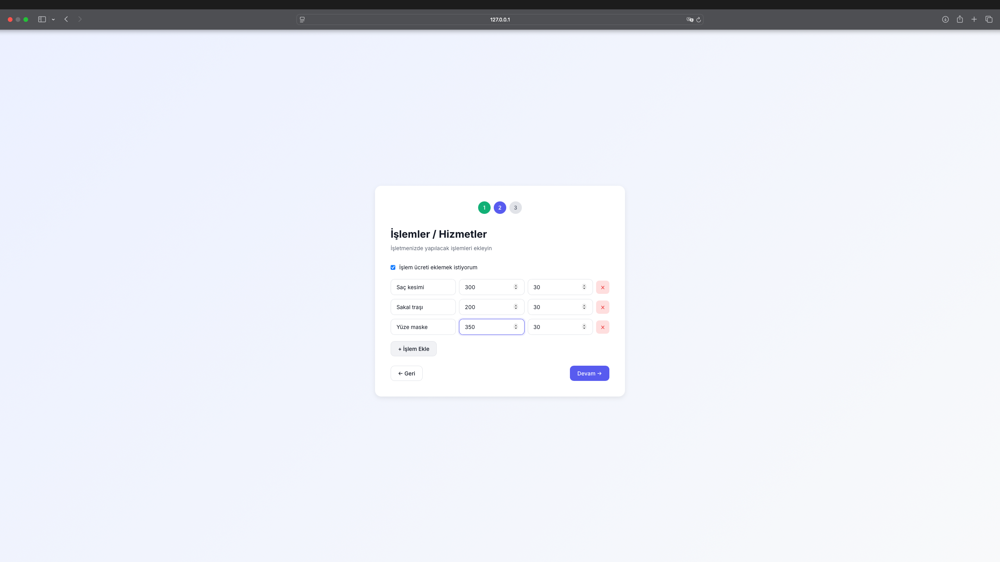
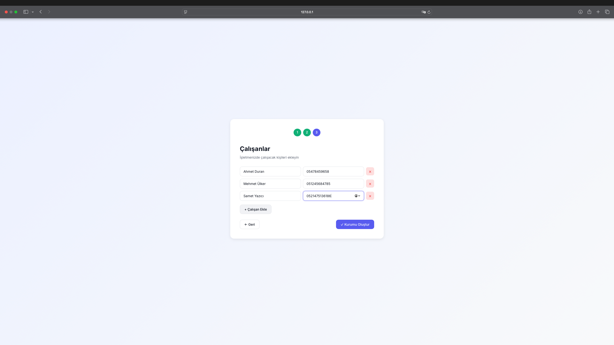
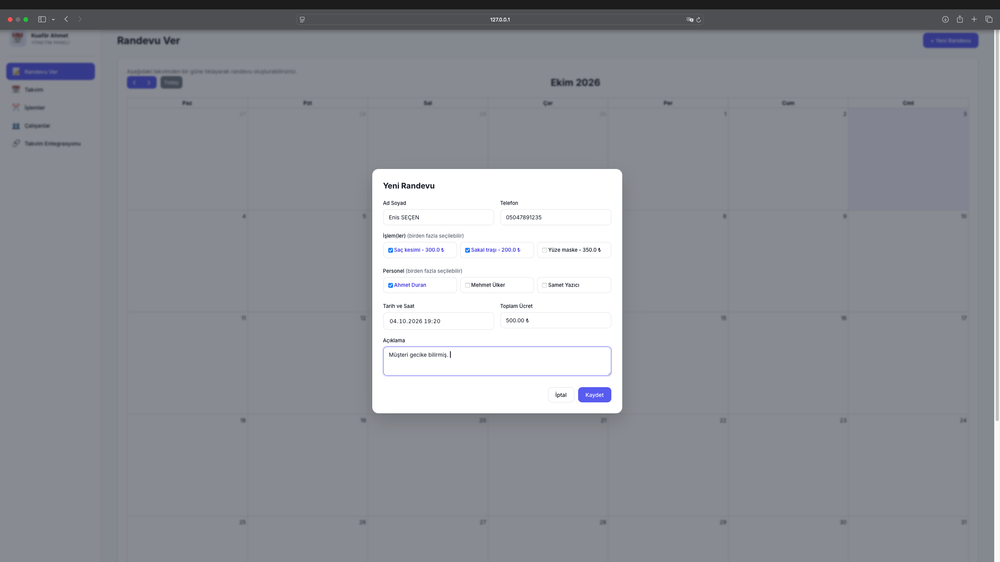
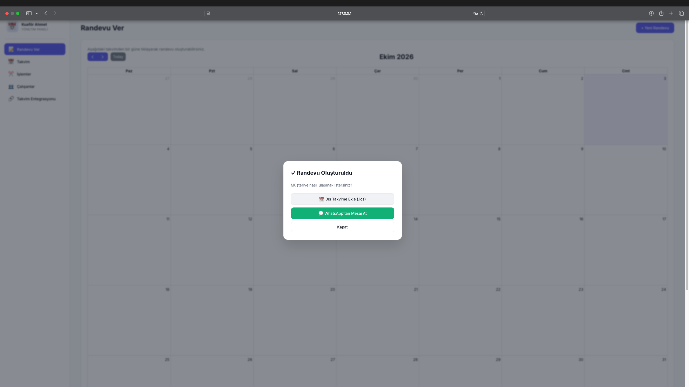
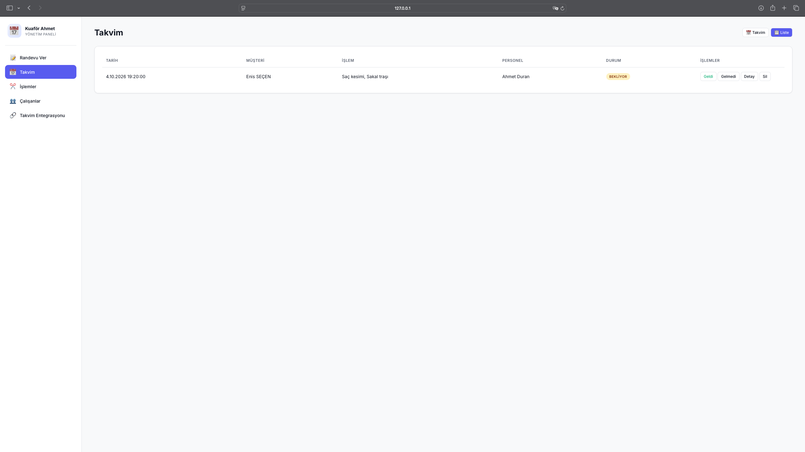
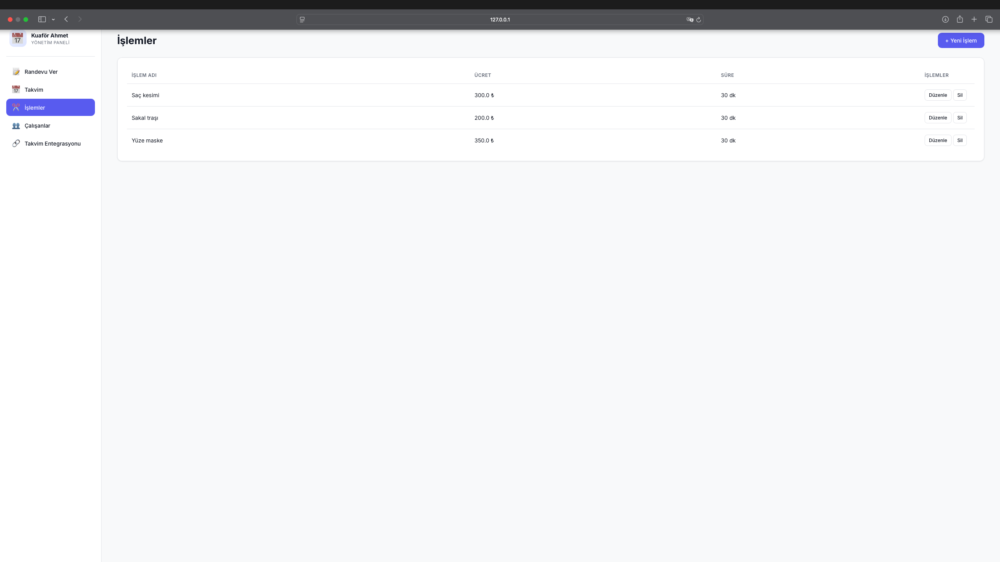
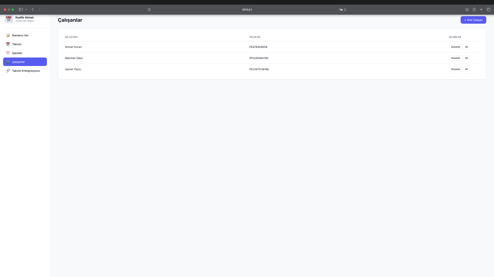
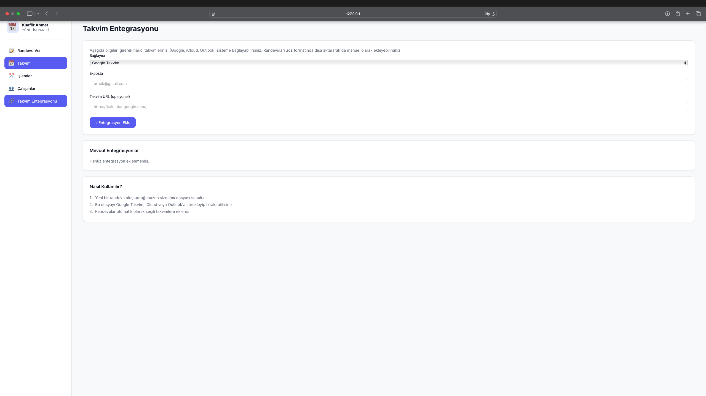

<div align="center">

# 📅 AppointFlow

### Modern, açık kaynaklı randevu ve takvim yönetim sistemi

**Kuaför, berber, klinik, güzellik merkezi ve her türlü randevulu işletme için**  
**tek tıkla randevu yönetimi, WhatsApp bilgilendirme ve takvim senkronizasyonu.**

[](https://www.gnu.org/licenses/agpl-3.0)
[](https://www.python.org/)
[](https://flask.palletsprojects.com/)
[](https://www.sqlite.org/)
[](http://makeapullrequest.com)
[](https://github.com/eminnessat/appointflow)

[Özellikler](#-özellikler) · [Ekran Görüntüleri](#-ekran-görüntüleri) · [Kurulum](#-kurulum) · [API](#-api-referansı) · [Katkı](#-katkıda-bulunma) · [Lisans](#-lisans)

</div>

---

## 🎯 Nedir Bu?

**AppointFlow**, küçük ve orta ölçekli işletmelerin randevu süreçlerini tamamen dijitalleştiren, modern ve minimalist bir web uygulamasıdır. Kurulum sihirbazı sayesinde **5 dakikada** işletmenizi sisteme kaydeder, çalışanlarınızı ve hizmetlerinizi tanımlar, hemen randevu almaya başlarsınız.

### 💡 Neden AppointFlow?

- 🚀 **Sıfır kurulum karmaşası** — SQLite ile dosya tabanlı, sunucu gerektirmez
- 📱 **Mobil uyumlu** — telefonda da masaüstünde de mükemmel görünür
- 💬 **WhatsApp entegrasyonu** — müşteriye tek tıkla hatırlatma mesajı
- 📅 **Takvim senkronizasyonu** — Google, iCloud, Outlook (.ics desteği)
- 🔓 **Açık kaynak** — AGPL-3.0, kendi sunucunuzda barındırın
- 🇹🇷 **Türkçe öncelikli** — yerel işletmeler için tasarlandı
- 🔌 **API-first** — mobil uygulama geliştirmeye hazır mimari

---

## ✨ Özellikler

### 🏢 İşletme Yönetimi
- ✅ 3 adımlı kurulum sihirbazı (İşletme → İşlemler → Çalışanlar)
- ✅ Çoklu işlem tanımı, opsiyonel ücret desteği
- ✅ Çalışan ekleme/düzenleme/silme
- ✅ Çalışan bazlı randevu atama

### 📅 Randevu Sistemi
- ✅ Görsel takvim (FullCalendar) — ay/hafta/gün görünümü
- ✅ Liste görünümü — düzenle/sil hızlı erişim
- ✅ Çoklu işlem ve çoklu personel seçimi
- ✅ Otomatik ücret hesaplama
- ✅ Durum takibi: **Bekliyor** / **Geldi** / **Gelmedi**
- ✅ Açıklama alanı

### 💬 İletişim
- ✅ WhatsApp'tan tek tıkla bilgilendirme mesajı
- ✅ Otomatik hazır mesaj şablonu
- ✅ Müşteri telefonu ile entegre

### 🔗 Takvim Entegrasyonu
- ✅ `.ics` dosyası indirme (Google Takvim, iCloud, Outlook uyumlu)
- ✅ Google/iCloud/Outlook entegrasyon kaydı
- ✅ Otomatik 30 dk öncesi hatırlatma alarmı
- ✅ REST API ile dış sistemlere veri aktarımı

### 🎨 Tasarım
- ✅ Modern minimalist arayüz (Inter font)
- ✅ Yumuşak indigo renk paleti
- ✅ Responsive (mobil/tablet/masaüstü)
- ✅ Karanlık moda hazır CSS değişkenleri

---

## 🖼️ Ekran Görüntüleri











---

## 🛠️ Teknoloji Yığını

| Katman | Teknoloji |
|--------|-----------|
| **Backend** | Python 3.10+, Flask 3.0 |
| **Veritabanı** | SQLite (dosya tabanlı), SQLAlchemy ORM |
| **Frontend** | Vanilla JS, HTML5, CSS3 |
| **Takvim** | FullCalendar 6.1 |
| **Font** | Inter (Google Fonts) |
| **Şablon** | Jinja2 |

---

## 🚀 Kurulum

### Gereksinimler
- Python 3.10 veya üzeri
- pip

### Adım Adım

```bash
# 1. Repoyu klonla
git clone https://github.com/mdaedalus/AppointFlow.git
cd rose

# 2. Sanal ortam oluştur
python -m venv venv

# Windows:
venv\Scripts\activate

# macOS/Linux:
source venv/bin/activate

# 3. Bağımlılıkları yükle
pip install -r requirements.txt

# 4. Uygulamayı başlat
python app.py
```

Tarayıcınızda açın: **http://localhost:5000**

İlk açılışta **kurulum sihirbazı** otomatik başlar. 🎉

---

## 📁 Proje Yapısı

```
rose/
├── app.py                      # Ana uygulama (Flask factory)
├── config.py                   # Yapılandırma
├── database.py                 # SQLAlchemy başlatma
├── models.py                   # Veri modelleri
├── requirements.txt
├── LICENSE                     # AGPL-3.0
├── README.md
│
├── docs/                       # 📸 Ekran görüntüleri
│   └── screenshots/
│     
│
├── routes/                     # Blueprint'ler
│   ├── __init__.py
│   ├── setup_routes.py        # Kurulum sihirbazı
│   ├── admin_routes.py        # Yönetim paneli
│   ├── employee_routes.py     # Çalışan
│   ├── appointment_routes.py  # Randevu CRUD
│   └── calendar_routes.py     # Takvim event'leri
│
├── services/                   # İş mantığı katmanı
│   ├── __init__.py
│   ├── whatsapp_service.py    # WhatsApp link üretici
│   ├── calendar_service.py    # ICS dosya üretici
│   └── sms_service.py         # SMS (placeholder)
│
├── templates/                  # Jinja2 şablonları
│   ├── base.html
│   ├── setup/
│   ├── admin/
│   └── employee/
│
├── static/
│   ├── css/style.css
│   └── js/
│
└── instance/
    └── randevu.db             # SQLite veritabanı (otomatik oluşur)
```

---

## 🔌 API Referansı

Tüm endpoint'ler JSON döner. Mobil uygulama geliştirmek için hazırdır.

### Randevu

| Metot | Endpoint | Açıklama |
|-------|----------|----------|
| `POST` | `/appointment/create` | Yeni randevu oluştur |
| `GET` | `/appointment/list` | Tüm randevuları listele |
| `GET` | `/appointment/<id>` | Randevu detayı |
| `PUT` | `/appointment/<id>` | Randevu güncelle |
| `DELETE` | `/appointment/<id>` | Randevu sil |
| `PUT` | `/appointment/<id>/status` | Durum güncelle (geldi/gelmedi) |
| `GET` | `/appointment/<id>/ics` | `.ics` dosyası indir |

### Takvim

| Metot | Endpoint | Açıklama |
|-------|----------|----------|
| `GET` | `/calendar/events` | FullCalendar event listesi |

### İşlemler / Çalışanlar

| Metot | Endpoint | Açıklama |
|-------|----------|----------|
| `POST` | `/admin/services/add` | Yeni işlem |
| `PUT` | `/admin/services/<id>` | İşlem güncelle |
| `DELETE` | `/admin/services/<id>` | İşlem sil |
| `POST` | `/admin/employees/add` | Yeni çalışan |
| `PUT` | `/admin/employees/<id>` | Çalışan güncelle |
| `DELETE` | `/admin/employees/<id>` | Çalışan sil |

### Örnek İstek

```bash
curl -X POST http://localhost:5000/appointment/create \
  -H "Content-Type: application/json" \
  -d '{
    "customer_name": "Ayşe Yılmaz",
    "customer_phone": "05551234567",
    "appointment_date": "2026-10-15T14:30",
    "service_ids": [1, 2],
    "employee_ids": [1],
    "description": "Saç kesimi + boya"
  }'
```

---

## 🗺️ Yol Haritası

- [x] v0.1 — Kurulum sihirbazı, randevu CRUD, takvim görünümü
- [x] v0.2 — WhatsApp entegrasyonu, `.ics` desteği
- [ ] v0.3 — Kullanıcı girişi (JWT)
- [ ] v0.4 — Çoklu işletme desteği (multi-tenant)
- [ ] v0.5 — SMS entegrasyonu (NetGSM, Twilio)
- [ ] v0.6 — Ödeme entegrasyonu (Stripe, iyzico)
- [ ] v0.7 — React Native mobil uygulama
- [ ] v1.0 — SaaS sürümü + Docker

---

## 🤝 Katkıda Bulunma

Katkılarınızı bekliyoruz! Büyük değişiklikler için önce bir **issue** açın.

```bash
# Fork → Clone → Branch → Commit → Push → PR
git checkout -b feature/yeni-ozellik
git commit -m "feat: yeni özellik eklendi"
git push origin feature/yeni-ozellik
```

### Commit Kuralları
- `feat:` yeni özellik
- `fix:` hata düzeltme
- `docs:` dokümantasyon
- `style:` kod formatı
- `refactor:` yeniden düzenleme
- `test:` test ekleme

---

## 💼 Ticari Kullanım & Lisanslama

Bu proje **AGPL-3.0** ile lisanslanmıştır.

### ✅ Yapabilirsiniz
- Ücretsiz kullanmak, değiştirmek, dağıtmak
- Ticari amaçla kullanmak (**açık kaynak şartıyla**)
- Kendi sunucunuzda barındırmak

### ⚠️ Şartlar
- Değiştirdiğiniz kodu **açık kaynak** olarak paylaşmalısınız
- Ağ üzerinden (SaaS) sunsanız bile kaynak kodu vermelisiniz

### 💰 Ticari Lisans (Kapalı Kaynak İsteyenler İçin)

Kodunuzu kapatmak veya SaaS olarak satmak istiyorsanız ticari lisans için iletişime geçin:

📧 **eminnesatg@gmail.com**

---

## 👨‍💻 Yazar

**Emin Neşat Gürses**

- 💼 LinkedIn: [Emin Neşat Gürses](https://www.linkedin.com/in/emin-ne%C5%9Fat-g%C3%BCrses-35723a284/)
- 📧 E-posta: [eminnesatg@gmail.com](mailto:eminnesatg@gmail.com)
- 🐙 GitHub: [@eminnessat](https://github.com/mdaedalus)

---

## 📄 Lisans

Bu proje **GNU Affero General Public License v3.0** ile lisanslanmıştır.  
Detaylar için [LICENSE](LICENSE) dosyasına bakın.


<div align="center">


</div>
